# CDR MONITORING APP (SERVERLESS) AWS SAM PROJECT..

This project is inspired by one of the project samples I found in the AWS Samples GitHub repository. The link is [
aws-devops-end-to-end-workshop](https://github.com/aws-samples/aws-devops-end-to-end-workshop).

This project is an end-to-end workshop and a great resource for learning the DevOps approach on AWS. I haven't yet done it, but I think it's awesome, and I will definitely build it in the near future. As part of my learning DevOps and coding skills, I will build my own project on-premise, which will be quite similar to this project, and then turn it into a serverless architecture.

## ON Premise project app.

**Achitecture**

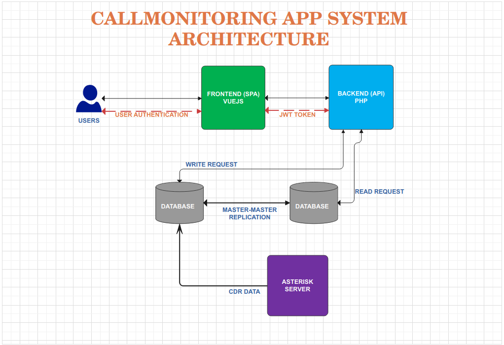

**Technologies Used**
- Frontend --> VUEJS Framework.
- Backend/API  --> PHP 
- Authentication --> JWT TOKEN
- Database --> Mysql


## AWS Serverless project app.

**Architecture**

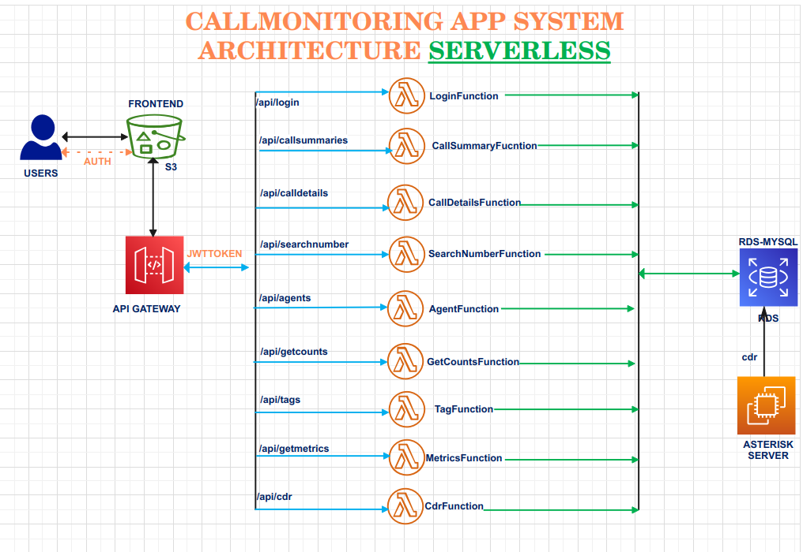

**Technologies Used**
- Frontend --> S3 Static Website (Build using VUEJS)
- Backend --> AWS Lambda 
- API --> API Gateway 
- Database --> RDS Mysql
- Authentication -->  JWT TOKEN

__**Note two way to implement authentication using jwt on API gateway or in Lambda. In this project is choose to implement this in lamba**__


## Project Implementation and Walkthrough 

For this project, I anticipate building numerous Lambda functions and API Gateway resources within it. Creating these manually is both cumbersome and error-prone. Fortunately, I can utilize AWS CloudFormation for this purpose, although even with CloudFormation's power, the setup process can still be challenging. Thankfully, I discovered AWS SAM, which seems well-suited for this project. Now, I just need to learn how to use it effectively.

I searched for tutorials and found the best one in the AWS Samples GitHub repositories. You can find it at [aws-serverless-workshops](https://github.com/aws-samples/aws-serverless-workshops/tree/master/DevOps)


**AWS SAM Commands Used in This Project**:
- sam init: Initialize a new serverless application project.
- sam build: Build your serverless application.
- sam local invoke: Invoke your Lambda functions locally.
- sam local start-api: Start a local API Gateway for testing your functions locally.
- sam deploy: Deploy your serverless application to AWS.
- sam delete: Delete resources created by the deployment.


**Initialize project**
```bash
   sam init
```
__For the options, I just followed the option on the aws-serverless-workshops__


**Configuring template.yaml file and creating lambda functions**

```yaml
AWSTemplateFormatVersion: '2010-09-09'
Transform: AWS::Serverless-2016-10-31
Description: >
  sbtph_api

  Sample SAM Template for sbtph_api


Resources:
  SBTPHWebSiteBucket:
    Type: "AWS::S3::Bucket"
    Properties:
      BucketEncryption:
        ServerSideEncryptionConfiguration:
          - BucketKeyEnabled: true
      VersioningConfiguration:
        Status: Enabled
      PublicAccessBlockConfiguration:
        BlockPublicAcls: false
        BlockPublicPolicy: false
        IgnorePublicAcls: false
        RestrictPublicBuckets: false
      WebsiteConfiguration:
        IndexDocument: index.html
        ErrorDocument: index.html

  SBTPHWebSiteBucketPolicy:
    Type: "AWS::S3::BucketPolicy"
    Properties:
      Bucket: !Ref SBTPHWebSiteBucket
      PolicyDocument:
        Version: "2012-10-17"
        Statement:
          - Sid: "AllowPublicRead"
            Effect: "Allow"
            Principal: "*"
            Action: "s3:GetObject"
            Resource: !Join
              - ''
              - - "arn:aws:s3:::"
                - !Ref SBTPHWebSiteBucket
                - /*


  MyApi:
    Type: AWS::Serverless::Api
    Properties:
      StageName: Prod
      Cors:
        AllowMethods: "'GET,POST,OPTIONS,DELETE,PUT'"
        AllowHeaders: "'Content-Type,Authorization,X-Forwarded-For'"
        AllowOrigin: "'*'"        

  LoginFunction:
    Type: AWS::Serverless::Function
    Properties:
      CodeUri: backend/
      Handler: login.lambda_handler
      Runtime: python3.10
      Architectures:
        - x86_64
      Events:
        Login:
          Type: Api
          Properties:
            RestApiId: !Ref MyApi
            Path: /api/login
            Method: post
            
  CallSummaryFunction:
    Type: AWS::Serverless::Function
    Properties:
      CodeUri: backend/
      Handler: call_summary.lambda_handler
      Runtime: python3.10
      Architectures:
        - x86_64
      Events:
        GetCallSummary:
          Type: Api
          Properties:
            Path: /api/callsummaries/{callsummaries}
            RestApiId: !Ref MyApi
            Method: get
      
  CallDetailsFunction:
    Type: AWS::Serverless::Function
    Properties:
      CodeUri: backend/
      Handler: call_details.lambda_handler
      Runtime: python3.10
      Architectures:
        - x86_64
      Events:
        GetCallDetails:
          Type: Api
          Properties:
            Path: /api/calldetails/{calldetails}
            RestApiId: !Ref MyApi
            Method: get

  SeachNumberFunction:
    Type: AWS::Serverless::Function
    Properties:
      CodeUri: backend/
      Handler: search_number.lambda_handler
      Runtime: python3.10
      Architectures:
        - x86_64
      Events:
        GetSearchNumber:
          Type: Api
          Properties:
            Path: /api/searchnumber/{search_type}
            RestApiId: !Ref MyApi
            Method: get    

  AgentFunction:
    Type: AWS::Serverless::Function
    Properties:
      CodeUri: backend/
      Handler: agents.lambda_handler
      Runtime: python3.10
      Architectures:
        - x86_64
      Events:
        GetAgentsInboundGroup:
          Type: Api
          Properties:
            Path: /api/agents/csd/agentphonelogsdetails
            RestApiId: !Ref MyApi
            Method: get

        GetAgentsInboundGroupDetails:
          Type: Api
          Properties:
            Path: /api/agents/csd/inbound_group
            RestApiId: !Ref MyApi
            Method: get

        GetAgent:
          Type: Api
          Properties:
            Path: /api/agents/{agent_type}/{extension}
            RestApiId: !Ref MyApi
            Method: get

        CreateAgent:
          Type: Api
          Properties:
            Path: /api/agents/{agent_type}
            RestApiId: !Ref MyApi
            Method: post

        UpdateAgent:
          Type: Api
          Properties:
            Path: /api/agents/{agent_type}
            RestApiId: !Ref MyApi
            Method: put

        DeleteAgent:
          Type: Api
          Properties:
            Path: /api/agents/{agent_type}/{extension}
            RestApiId: !Ref MyApi
            Method: delete

        GetAgents:
          Type: Api
          Properties:
            Path: /api/agents/{agent_type}
            RestApiId: !Ref MyApi
            Method: get
            
  GetCountsFunction:
    Type: AWS::Serverless::Function
    Properties:
      CodeUri: backend/
      Handler: counts.lambda_handler
      Runtime: python3.10
      Architectures:
        - x86_64
      Events:
        GetCounts:
          Type: Api
          Properties:
            Path: /api/getcounts/{count}
            RestApiId: !Ref MyApi
            Method: get
               
  TagFunction:
    Type: AWS::Serverless::Function
    Properties:
      CodeUri: backend/
      Handler: tag.lambda_handler
      Runtime: python3.10
      Architectures:
        - x86_64
      Events:              
        GetTags:
          Type: Api
          Properties:
            Path: /api/tags
            RestApiId: !Ref MyApi
            Method: get  
        CreateTag:
          Type: Api
          Properties:
            Path: /api/tags/{tagtype}
            RestApiId: !Ref MyApi
            Method: post                                                   
        DeleteAgent:
          Type: Api
          Properties:
            Path: /api/tags
            RestApiId: !Ref MyApi
            Method: delete             

  MetricsFunction:
    Type: AWS::Serverless::Function
    Properties:
      CodeUri: backend/
      Handler: metrics.lambda_handler
      Runtime: python3.10
      Architectures:
        - x86_64
      Events:
        GetMetrics:
          Type: Api
          Properties:
            Path: /api/getmetrics
            RestApiId: !Ref MyApi
            Method: get

  CdrFunction:
    Type: AWS::Serverless::Function
    Properties:
      CodeUri: backend/
      Handler: cdrs.lambda_handler
      Runtime: python3.10
      Architectures:
        - x86_64
      Events:
        UpdateCdr:
          Type: Api
          Properties:
            Path: /api/cdr/{cdrtype}
            RestApiId: !Ref MyApi
            Method: post              
        GetCdr:
          Type: Api
          Properties:
            Path: /api/cdr/{cdrtype}
            RestApiId: !Ref MyApi
            Method: get           
        DeleteCdr:
          Type: Api
          Properties:
            Path: /api/cdr/{cdrtype}
            RestApiId: !Ref MyApi
            Method: delete                                                   

Outputs:
  ApiUrl:
    Description: "API Gateway endpoint URL"
    Value: !Sub "https://${MyApi}.execute-api.${AWS::Region}.amazonaws.com/Prod"
    Export:
      Name: ApiUrl
  SBTPHWebSiteBucket:
    Description: "Frontend Bucket"
    Value: !Ref SBTPHWebSiteBucket

```

For my Lambda functions, since PHP is not yet available as a runtime, I converted the code to Python3. The code can be found in the backend folder.


My Vue.js code for the frontend is also ready, but before deploying it to S3 as a static website, we need to test it locally. Our API and Lambda functions also need to be tested locally before we can deploy them to the cloud.. 

**For AWS SAM local testing, additional requirements must be installed on your local machine.**
- docker engine/docker desktop
- your chossen runtime (in my case I used python3 on my backend and nodejs 16.x for my frontend)
- Mysql Database

Once all the additional requirements are installed, I proceed with the following steps:
- Restore my database on my local database
```bash
   mysql -u robudexadmin -p -e "CREATE DATABASE cmdb;" && mysql -u robudexadmin -p cmdb < db.sql
```
__Where my mysqluser = 'robudexadmin', and  database_name = 'cmdb'__ 

__Note that all customer/client numbers have been changed for security purposes. (All numbers are fake.)__

- I cd (change directory) to the backend folder, create a requirements.txt file, paste all the required modules/libraries into it, and then install them using pip install -r requirements.txt.
  
```bash
   pip install -r requirements.txt
```

- I updated the template.yaml by adding the following configuration below the Resources section. This configuration contains the credentials for the local MySQL database and settings for JWT tokens.

```yaml

Globals:
  Function:
    Timeout: 30
    MemorySize: 256
    Environment:
      Variables:
        DB_HOST: 167.71.22.129
        DB_PORT: 3306
        DB_NAME: cmdb
        DB_USER: robudexadmin
        DB_PASSWORD: Kk0UyyRgFOQpehXBtGx6
        SECRET_KEY: 6d6bdbc3239ec3f8f0eadcee0633b49597df5956ac46735a23e822964c04f0b8
        ALGORITHM: HS256
        ACCESS_TOKEN_EXPIRE_MINUTES: 30 
   
```

- Once everything is set up, I run the following commands in the terminal:
```bash
   sam build 
   sam local invoke start-api --host 0.0.0.0 #listen to all ip address of my machine.

```

**Local Backend is now running and listen to port 3000**

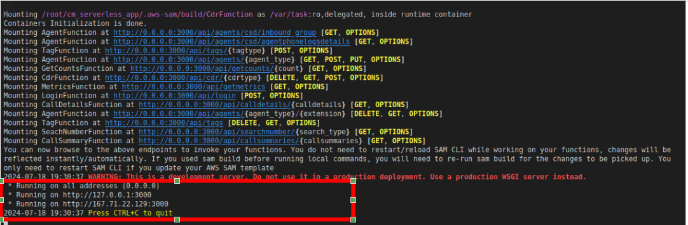

- Our API/backend is now ready. It's time to fire up the frontend. Open a new terminal, cd to the frontend folder, and run npm install --save to install all the dependencies.

```bash
   npm install --save-dev
```

- Edit the src/api_awssam.js file and update the HTTPADDR variable with the address where your API is listening (e.g., http://167.71.22.129:3000). Be sure to suffix it with /api (e.g., http://167.71.22.129:3000/api).

- Run npm run serve 

```bash
   npm run serve
```

**Frontend is running as well.**
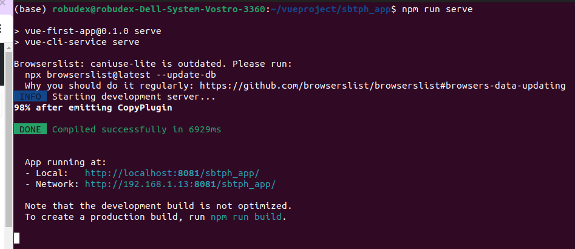


**Time to test it.**

- Open the browser, copy the frontend IP address, and log in using the extension 6336 and the secret 20006336

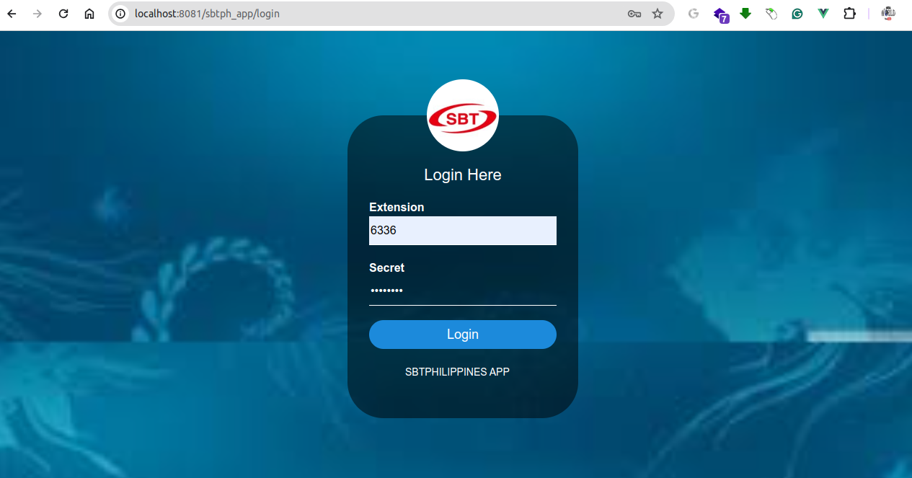


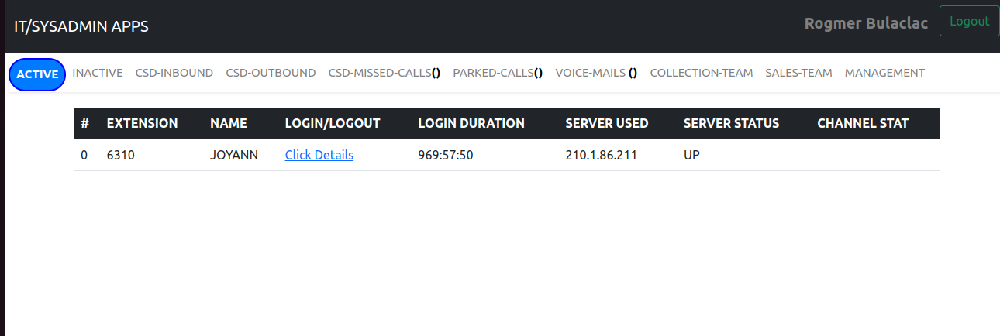

- Our Backend logs also that is successfully generate  jwt token

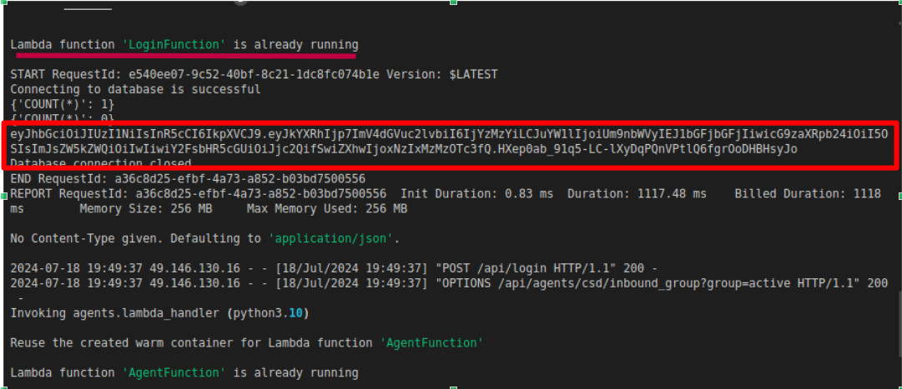


- Let's Generates some cdr metrics 

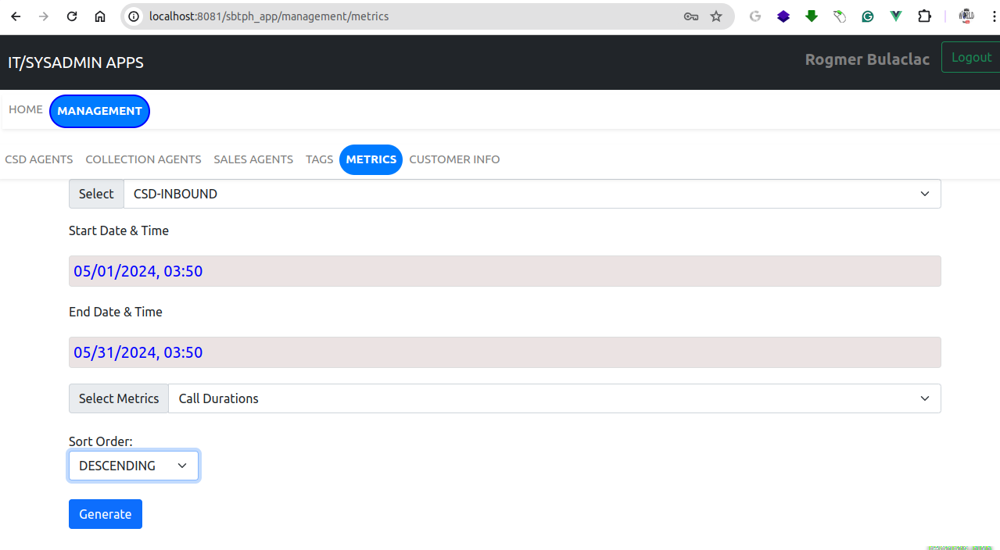

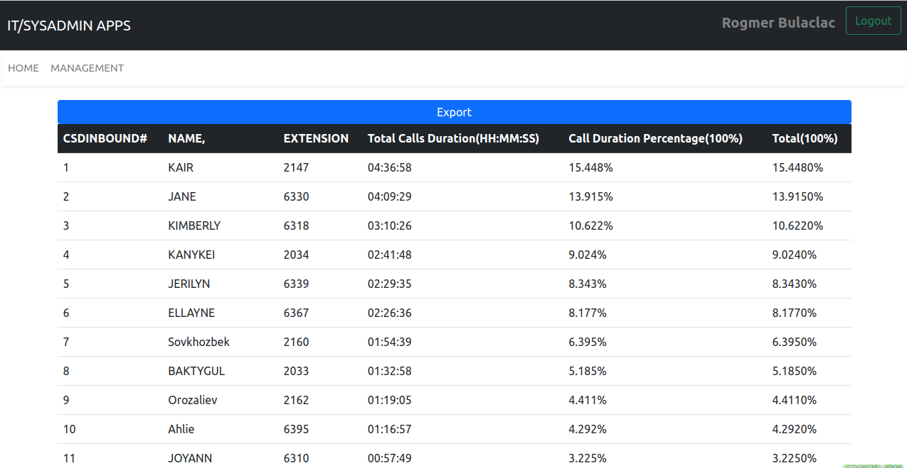

- Our backend has also responded successfully.


## Deploy in AWS CLOUD.

Now that local testing is successful, it's time to deploy to the cloud. But first, we need to start the RDS database instance and update our template.yaml file.

**RDS Instance and SG Settings:**
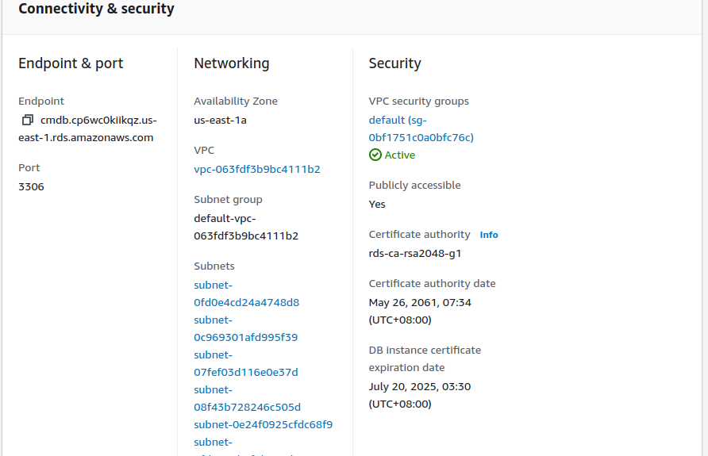

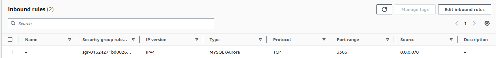


- Please note that in this project, I set my RDS instance to be publicly accessible ('Yes') because my Lambda function is not in a VPC. However, for best practices, always set public accessibility to 'No' and place the Lambda function inside the VPC.

- I also configured the security group to allow any IPv4 access on port 3306 because Lambda functions do not have static public IP addresses, which makes it challenging to whitelist a specific IP. But again, this is not a best practice. **Putting the Lambda function in the same VPC as the RDS instance is still the best practice.**


**Connect to RDS Instance and Restore**

```bash
   mysql -urobudexadmin -h cmdb.cp6wc0kiikqz.us-east-1.rds.amazonaws.com  cmdb -p < db.sql #restore the db
   mysql -urobudexadmin  --database cmdb  -h cmdb.cp6wc0kiikqz.us-east-1.rds.amazonaws.com -p #Connect to db instance
```

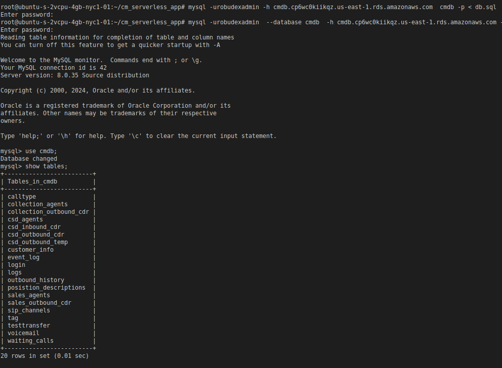


- Update the template.yaml to the new db settings. Where 'cmdb.cp6wc0kiikqz.us-east-1.rds.amazonaws.com' is my  rds endpoint.

```yaml
Globals:
  Function:
    Timeout: 30
    MemorySize: 256
    Environment:
      Variables:
        DB_HOST: cmdb.cp6wc0kiikqz.us-east-1.rds.amazonaws.com
        DB_PORT: 3306
        DB_NAME: cmdb
        DB_USER: robudexadmin

```


